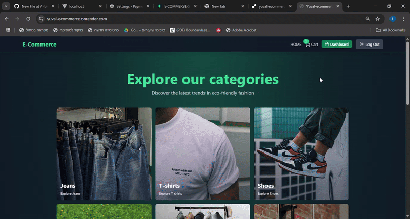

# 📌 E-Commerce Store

An eco-friendly full-stack clothing store featuring 7 categories, secure authentication, Stripe integration, admin analytics, and a user-friendly experience.

---

## 📺 Demo

## 🚀 Features

- 🛍️ Browse products by categories with sorting filters
- 🧾 Stripe-powered checkout with success and cancel pages
- 🔐 Robust authentication using access/refresh tokens (with Redis)
- 📊 Admin dashboard for managing products and viewing analytics
- ⚡ Realtime updates with state management and Axios interceptors
- 📱 Fully responsive design

## 🧑‍💻 Tech Stack

Frontend
React, Vite, Tailwind CSS, Zustand, Axios, React Router, Framer Motion, Stripe.js, Recharts, Lucide React

Backend
Node.js, Express, MongoDB (Mongoose), Redis, Cloudinary, Stripe, Bcrypt.js, JWT, Cookie-Parser, Dotenv

## 🔐 Environment Variables Needed

PORT=
MONGO_URI=
UPSTASH_REDIS_URL=
ACCESS_TOKEN_SECRET=
REFRESH_TOKEN_SECRET=
CLOUDINARY_CLOUD_NAME=
CLOUDINARY_API_KEY=
CLOUDINARY_API_SECRET=
STRIPE_SECRETE_KEY=
CLIENT_URL=
NODE_ENV=

## 📦 Installation

From the root folder:

npm run build 
npm run start (for production)

Thanks for checking it out! 🌿